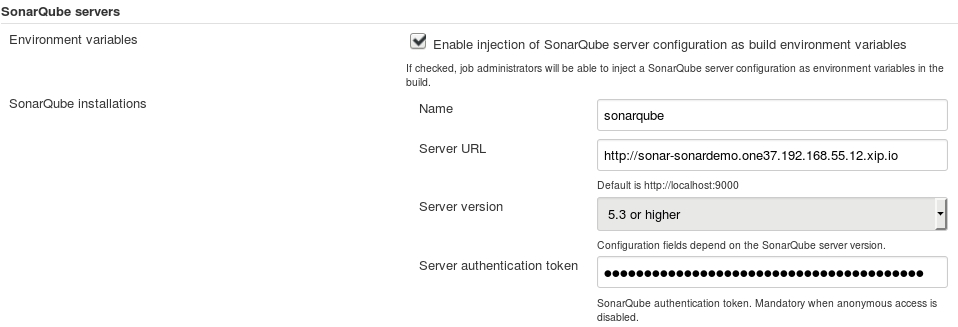
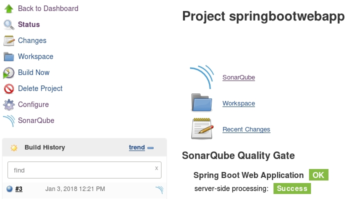
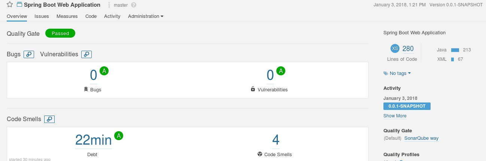

# SonarQube on OpenShift (Persistent)

**NOTE: For the ephemeral deployment refer to [SonarQube on OpehShift (Ephemeral)](README.ephemeral.md)**

This document goes through an example of a full CI/CD workflow for a Java application.
1. The application is installed from a Git repository
1. Some code changes are added to the application source code
1. The new code is analyzed in SonarQube
1. A build containing the new code is made available on OpenShift

For that example the following components are required:
1. An example application on a Git repository
1. Jenkins for the continuous integration
1. SonarQube for the code analysis
1. PostgreSQL for the persistence

All the required files are available in this GitHub repository under `ocp-resources`

## Create all the Persistent Volumes
**Note:** I have used `hostPath` for simplicity but any other solution should be fine as well.

## Install SonarQube
First the Persistent volumes have to be created:
* postgresql-volume: To be used by PostgreSQL server
```
$ oc create -f ocp-resources/postgresql-pv.yaml
persistentvolume "postgresql-volume" created
```
* sonar-data-volume: Contains all the data related to the web application and Elasticsearch
* sonar-extensions-volume: Persists all the installed extensions/plugins

```
$ oc create -f ocp-resources/sonar-pv.yaml
persistentvolume "sonar-data-volume" created
persistentvolume "sonar-extensions-volume" created
```

A template has been defined including the required elements like `ServiceAccount`, `PersitentVolumeClaim`, `Route`, `Service`, `Secret`, `DeploymentConfig` for deploying both SonarQube and PostgreSQL. In order to create the elements it doesn’t necessarily need to be created, just processed but for the sake of reusability I have preferred the creation over the processing.
```
$ oc create -f ocp-resources/sonarqube-postgresql-template.yaml -n openshift
template "sonarqube-postgresql" created
```
Once created it can be used to create a new application with the default values:
```
$  oc new-app sonarqube-persistent
--> Deploying template "sonardemo/sonarqube-postgresql" to project sonardemo

     SonarQube PostgreSQL (Persistent)
     ---------
     Sonarqube service, with PostgreSQL persistent storage.

     NOTE: You must have persistent volumes available in your cluster to use this template.

     A Sonarqube service has been created in your project. You can access using admin/admin.

     * With parameters:
        * SonarQube Service Name=sonar
        * Data Volume Capacity=256Mi
        * Extensions Volume Capacity=256Mi
        * Memory Limits=2Gi
        * PostgreSQL Username=sonarbwDs # generated
        * PostgreSQL Password=QwqgcypemxsNAXLo # generated
        * PostgreSQL Volume Capacity=1Gi
        * PostgreSQL Memory Limit=512Mi
        * Version of PostgreSQL Image=9.5
        * Namespace=openshift

--> Creating resources ...
    route "sonar" created
    persistentvolumeclaim "sonar-data" created
    persistentvolumeclaim "sonar-extensions" created
    deploymentconfig "sonar" created
    serviceaccount "sonar" created
    service "sonar" created
    secret "sonar-postgresql" created
    service "sonar-postgresql" created
    persistentvolumeclaim "sonar-postgresql" created
    deploymentconfig "sonar-postgresql" created
--> Success
    Access your application via route 'sonar-sonardemo.apps.example.com'
    Run 'oc status' to view your app.
```

## Install Jenkins
The first step is, as before, to create the PersistentVolume.
```
$ oc create -f ocp-resources/jenkins-pv.yaml
persistentvolume "jenkins-volume" created
```
When installing Jenkins persistent it is possible to specify which plugins to install. In this case, the SonarQube Scanner for Jenkins plugin is specified.

```
$ oc new-app jenkins-postgresql -e INSTALL_PLUGINS=sonar:2.6.1
--> Deploying template "openshift/jenkins-persistent" to project sonardemo

     Jenkins (Persistent)
     ---------
     Jenkins service, with persistent storage.

     NOTE: You must have persistent volumes available in your cluster to use this template.

     A Jenkins service has been created in your project.  Log into Jenkins with your OpenShift account.  The tutorial at https://github.com/openshift/origin/blob/master/examples/jenkins/README.md contains more information about using this template.

     * With parameters:
        * Jenkins Service Name=jenkins
        * Jenkins JNLP Service Name=jenkins-jnlp
        * Enable OAuth in Jenkins=true
        * Memory Limit=512Mi
        * Volume Capacity=1Gi
        * Jenkins ImageStream Namespace=openshift
        * Jenkins ImageStreamTag=jenkins:latest

--> Creating resources ...
    route "jenkins" created
    persistentvolumeclaim "jenkins" created
    deploymentconfig "jenkins" created
    serviceaccount "jenkins" created
    rolebinding "jenkins_edit" created
    service "jenkins-jnlp" created
    service "jenkins" created
--> Success
    Access your application via route 'jenkins-sonardemo.apps.example.com'
    Run 'oc status' to view your app.
```

## Checkpoint
At this stage, all three pods should be running and healthy.
```
$ oc get pods
NAME                       READY     STATUS    RESTARTS   AGE
jenkins-1-phxxq            1/1       Running   0          1h
sonar-postgresql-1-kxgd9   1/1       Running   0          55m
sonar-1-snkms              1/1       Running   0          27m
```
Besides, it should be able to access Jenkins in the following URL:

    https://jenkins-sonardemo.apps.example.com

And SonarQube:

    http://sonar-sonardemo.apps.example.com


## Configure SonarQube
Log in as admin/admin and a wizard will be prompted asking to generate a token that will be used by clients to interact with SonarQube API.
After defining “default” as the token name, the value is generated. In my case is:

    72e4892fc45900c362a4f34afb917b845e90b7b2

Keep it as it will be used later on when configuring SonarQube on Jenkins.

SonarQube installs some plugins and defines some quality profiles for the most common programming languages. As the application to deploy is implemented in Java no additional plugins are needed.

## Configure Jenkins
**NOTE:** In my case I had to update all the plugins and restart Jenkins due to a version incompatibility between the installed plugins.

First of all the Sonar server needs to be configured. Under the “Manage Jenkins” → “Configure System” menu there is the “SonarQube servers” section.
In this section, select the “Enable injection of SonarQube server configuration as build environment variables” checkbox and click “Add SonarQube”. After that provide a name, the URL of the route and the token generated in the previous step.



**NOTE:** The service endpoint (http://sonar:9000) should be enough for Jenkins to communicate with SonarQube, however some links are embedded in the Jenkins UI that redirects the user to the SonarQube web console but the browser won’t be able to show resolve the address as it is internal to the cluster.

Save the changes.

## Create the Jenkins project
Create a new Freestyle project called “springbootwebapp” and configure it with the following options:
1. General
    * (Check) Restrict where this project can be run
    * Label expression: maven
1. Source Code Management
    * Git
    * URL: https://github.com/ruromero/springbootwebapp
1. Build environment:
    * (Check) Prepare SonarQube Scanner environment
1. Build
    1. Execute shell
        * Command: `mvn test $SONAR_MAVEN_GOAL -Dsonar.host.url=$SONAR_HOST_URL`
    1. Trigger OpenShift Build
        * BuildConfig: springbootwebapp

Save the changes.

## Create the example application
I have chosen a sample SpringBoot application which is located in this GitHub repository:

    https://github.com/ruromero/springbootwebapp

In order to install it run the following command:

```
$ oc new-app redhat-openjdk18-openshift:1.2~https://github.com/ruromero/springbootwebapp
--> Found image 675d02a (8 weeks old) in image stream "openshift/redhat-openjdk18-openshift" under tag "1.2" for "redhat-openjdk18-openshift:1.2"

    Java Applications
    -----------------
    Platform for building and running plain Java applications (fat-jar and flat classpath)

    Tags: builder, java

    * A source build using source code from https://github.com/ruromero/springbootwebapp will be created
      * The resulting image will be pushed to image stream "springbootwebapp:latest"
      * Use 'start-build' to trigger a new build
    * This image will be deployed in deployment config "springbootwebapp"
    * Ports 8080/tcp, 8443/tcp, 8778/tcp will be load balanced by service "springbootwebapp"
      * Other containers can access this service through the hostname "springbootwebapp"

--> Creating resources ...
    imagestream "springbootwebapp" created
    buildconfig "springbootwebapp" created
    deploymentconfig "springbootwebapp" created
    service "springbootwebapp" created
--> Success
    Build scheduled, use 'oc logs -f bc/springbootwebapp' to track its progress.
    Application is not exposed. You can expose services to the outside world by executing one or more of the commands below:
     'oc expose svc/springbootwebapp'
    Run 'oc status' to view your app.
```

And finally to make it accessible, the service needs to be exposed:
```
$ oc expose svc springbootwebapp
route "springbootwebapp" exposed
```

After the initial build, the application should be available on the URL defined in the route:

    http://springbootwebapp-sonardemo.apps.example.com


## Analyze the code
From Jenkins request a new build from the “Build Now” button. This will create a slave pod that has Maven installed and will build the code and run the tests. Finally it will run SonarQube Scanner and send the results to SonarQube web application.

In the console output it can be seen how the analysis took place:
```
[INFO] Analysis report generated in 179ms, dir size=78 KB
[INFO] Analysis reports compressed in 25ms, zip size=37 KB
[INFO] Analysis report uploaded in 557ms
[INFO] ANALYSIS SUCCESSFUL, you can browse http://sonar-sonardemo.apps.example.com/dashboard/index/guru.springframework:spring-boot-web
[INFO] Note that you will be able to access the updated dashboard once the server has processed the submitted analysis report
[INFO] More about the report processing at http://sonar-sonardemo.apps.example.com/api/ce/task?id=AWC7-HjI_ugAW623j7y-
```
Finally, the build will be triggered and the application will be built using the latest version of the source code.
```
Starting the "Trigger OpenShift Build" step with build config "springbootwebapp" from the project "sonardemo".


 Started build "springbootwebapp-2" and waiting for build completion ...
Operation will timeout after 900000 milliseconds


Exiting "Trigger OpenShift Build" successfully; build "springbootwebapp-2" has completed with status:  [Complete].
```

In the Jenkins project dashboard there are several references to SonarQube


And the results can be accessed by following any of the SonarQube links.


## Further considerations
In this example I didn’t configure any trigger for the builds but the Jenkins project can be configured to either periodically poll the Git repository, to do periodical builds or even to listen to Webhooks.
